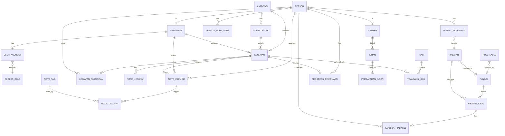

# Project Overview and SDD

## 1. Overview

### 1.1 Tujuan Aplikasi

Aplikasi ini adalah sistem monitoring anggota komunitas yang berfungsi untuk:

- menyimpan data master anggota dan pengurus
- mencatat kegiatan, peserta, pelaksana, dan hasil kegiatan
- memonitor perkembangan anggota per area pembinaan
- memetakan potensi anggota dan pengurus ke role atau jabatan tertentu
- menyimpan histori note atau evaluasi tanpa menghapus catatan lama
- mengelola iuran dan kas untuk kebutuhan operasional komunitas
- menyediakan dashboard agar pengurus dapat mengambil keputusan lebih tepat

### 1.2 Aktor Utama

- `Super Admin`
- `Pengurus`
- `Member` non-login

### 1.3 Prinsip Domain

- `RBAC role` hanya untuk hak akses login aplikasi
- `Role individu` melekat ke orang sebagai status, potensi, atau penugasan
- `Fungsi` adalah divisi atau area kerja
- `Jabatan` adalah posisi konkret dalam fungsi
- `Note` adalah histori evaluasi
- `Target pembinaan` adalah arah pengembangan seseorang

### 1.4 Ringkasan Masalah yang Diselesaikan

Sistem ini dibangun untuk membantu komunitas menjawab pertanyaan berikut:

- anggota ini ikut kegiatan apa saja
- anggota ini perkembangannya sudah sampai mana
- anggota ini sedang diarahkan menjadi apa
- pengurus harus melakukan pembinaan apa untuk target tersebut
- siapa calon paling siap untuk jabatan tertentu
- siapa yang rutin iuran dan bagaimana kondisi kas komunitas

## 2. Scope

### 2.1 In Scope V1

- master member
- master pengurus
- akun login dan RBAC dasar
- kategori dan subkategori kegiatan
- kegiatan dan kalender
- kehadiran atau pelibat kegiatan
- note umum dan note individu
- monitoring atau progress anggota
- role individu, fungsi, dan jabatan
- target pembinaan
- struktur pengurus ideal
- iuran member
- kas dan transaksi kas

### 2.2 Out of Scope V1

- mobile app native
- workflow approval kompleks multi-level
- akuntansi lengkap
- notifikasi omnichannel
- rekomendasi otomatis berbasis AI

## 3. Business Goals

- pengurus mengetahui perkembangan setiap anggota
- pengurus mengetahui siapa yang cocok diarahkan ke jabatan tertentu
- pengurus mengetahui tindak lanjut yang harus dilakukan untuk tiap target pembinaan
- semua kegiatan, evaluasi, dan keuangan tercatat secara historis
- struktur pengurus ideal dapat dipantau: posisi terisi, calon, dan gap

## 4. User Roles

### 4.1 Super Admin

- mengelola semua master data
- mengelola user dan RBAC
- melihat seluruh member, kegiatan, keuangan, dan dashboard global
- mengelola struktur pengurus ideal
- mengelola master tag note, kategori, fungsi, dan jabatan

### 4.2 Pengurus

- login ke sistem
- membuat dan mengelola kegiatan sesuai akses
- menambahkan note kegiatan dan note individu
- mengelola progress pembinaan sesuai area tanggung jawab
- melihat member atau pengurus sesuai cakupan akses

### 4.3 Member

- tidak memiliki akun login
- hanya menjadi subjek data, monitoring, iuran, dan pembinaan

## 5. Core Concepts

### 5.1 Role Akses vs Role Individu

`Role akses` digunakan untuk menentukan hak akses aplikasi, misalnya:

- `super_admin`
- `pembina_materi`
- `pengurus_keuangan`

`Role individu` digunakan untuk status atau peran yang melekat ke orang, misalnya:

- `walas`
- `calon bendahara`
- `calon pengurus olahraga`

### 5.2 Fungsi vs Jabatan

`Fungsi` adalah area kerja atau divisi, misalnya:

- `keuangan`
- `olahraga`
- `materi`

`Jabatan` adalah posisi konkret di dalam fungsi, misalnya:

- `bendahara`
- `koordinator olahraga`

### 5.3 Note

Note adalah catatan evaluasi yang bersifat historis dan tidak overwrite.

Jenis note:

- `Note kegiatan`: catatan umum untuk sebuah kegiatan
- `Note individu`: catatan personal pada seseorang, dapat berasal dari kegiatan atau observasi langsung

Setiap note individu sebaiknya memiliki:

- penulis
- subjek orang
- tanggal
- isi
- tag
- level
- sentiment
- status tindak lanjut
- sumber

Contoh tag:

- `akademik`
- `disiplin`
- `keuangan`
- `kepemimpinan`
- `fisik`
- `ibadah`

### 5.4 Target Pembinaan

Target pembinaan adalah arah pengembangan seseorang menuju role atau jabatan tertentu.

Contoh:

- `B` diarahkan menjadi `calon pengurus olahraga`
- `A` diarahkan menjadi `calon bendahara`

### 5.5 Struktur Pengurus Ideal

Struktur pengurus ideal adalah modul yang mendefinisikan:

- fungsi
- jabatan
- tujuan jabatan
- aktivitas atau tanggung jawab utama
- jumlah kebutuhan posisi
- kandidat calon
- kandidat yang sudah ditetapkan

### 5.6 Keuangan

Domain keuangan dibagi menjadi:

- `Iuran`
- `Kas`
- `Transaksi kas`

Iuran berfungsi untuk melihat kedisiplinan anggota.

Kas berfungsi untuk menyimpan saldo organisasi.

Transaksi kas berfungsi untuk mencatat histori pemasukan dan pengeluaran, termasuk pengeluaran kegiatan.

## 6. Main Modules

### 6.1 Master Data

- member
- pengurus
- akun pengurus
- role akses
- role individu
- fungsi
- jabatan
- kategori
- subkategori
- tag note

### 6.2 Kegiatan

- buat atau edit kegiatan
- pilih kategori dan subkategori
- tentukan waktu dan status
- tambah peserta member atau pengurus
- tambah note umum kegiatan
- tambah note individu dari kegiatan
- update progres peserta dari hasil kegiatan

### 6.3 Profil dan Monitoring

- profil member atau pengurus
- riwayat kegiatan
- riwayat note
- progress pembinaan
- role individu aktif atau riwayat
- target pembinaan
- tindak lanjut pembinaan

### 6.4 Pengurus Ideal

- daftar fungsi
- daftar jabatan
- tujuan jabatan
- aktivitas dan tanggung jawab jabatan
- posisi terisi atau kosong
- kandidat calon atau ditetapkan
- kebutuhan pembinaan per jabatan

### 6.5 Keuangan

- generate atau tagih iuran per periode
- input pembayaran iuran
- kas umum
- pemasukan dan pengeluaran
- pengeluaran terkait kegiatan
- rekap tunggakan dan saldo

### 6.6 Dashboard dan Kalender

- dashboard super admin
- dashboard pengurus
- kalender kegiatan global
- kalender per pengurus atau per fungsi
- rekap aktivitas per tanggal

## 7. Core Entities

- `Person`
- `Member`
- `Pengurus`
- `User Account`
- `Access Role`
- `Role Label`
- `Fungsi`
- `Jabatan`
- `Kategori`
- `Subkategori`
- `Kegiatan`
- `Kegiatan Partisipan`
- `Note Kegiatan`
- `Note Individu`
- `Note Tag`
- `Target Pembinaan`
- `Progress Pembinaan`
- `Iuran`
- `Pembayaran Iuran`
- `Kas`
- `Transaksi Kas`
- `Jabatan Ideal`
- `Kandidat Jabatan`

## 8. Key Business Rules

- hanya `pengurus` yang bisa login
- `member` tidak bisa login
- satu orang bisa punya banyak `role individu`
- satu orang bisa punya lebih dari satu target pembinaan, tetapi sebaiknya ada satu target prioritas aktif
- note bersifat historis dan tidak overwrite
- note individu dapat memiliki banyak tag
- master tag note harus terkontrol
- kegiatan dapat melibatkan member dan pengurus sekaligus
- kegiatan dapat menghasilkan update progress ke banyak orang
- iuran per periode harus dapat dilacak statusnya: `belum bayar`, `sebagian`, `lunas`
- kas harus berbasis histori transaksi, bukan edit saldo manual langsung
- struktur pengurus ideal harus mendukung status `calon` dan `ditetapkan`

## 9. Core Workflows

### 9.1 Workflow Kegiatan Kelas

Contoh kasus:

- kegiatan `Kelas Sholat`
- dilaksanakan hari ini jam `22.00`
- tema `Materi Sholat`
- peserta member `A, B, C`
- walas `D`
- diinput oleh pengurus dengan role akses `pembina_materi`

Alur:

1. Pengurus membuat kegiatan.
2. Memilih kategori `kelas` dan tema `materi sholat`.
3. Menentukan tanggal dan jam.
4. Menambahkan peserta `A, B, C` dan `D`.
5. Menyimpan kehadiran dan status kegiatan.
6. Menambahkan note umum kegiatan.
7. Menambahkan note individu jika ada.
8. Sistem menambahkan riwayat kegiatan ke profil peserta.
9. Sistem dapat membuat atau mengupdate progress pembinaan peserta.

### 9.2 Workflow Note Individu

1. Pengurus membuka profil member.
2. Menambahkan note baru.
3. Memilih tag, level, arah evaluasi, isi, dan tindak lanjut.
4. Note tersimpan sebagai histori.
5. Note dapat difilter per tag, sumber, atau status tindak lanjut.

### 9.3 Workflow Target Pembinaan

1. Pengurus menetapkan target pembinaan untuk member.
2. Memilih target jabatan atau role individu.
3. Menentukan alasan, indikator, dan langkah pembinaan.
4. Mengisi progress berkala berdasarkan kegiatan dan evaluasi.
5. Dashboard menampilkan kesiapan dan gap pembinaan.

### 9.4 Workflow Iuran dan Kas

1. Sistem atau pengurus membuat periode iuran.
2. Member ditandai status pembayarannya.
3. Pembayaran masuk menambah transaksi kas masuk.
4. Pengeluaran kegiatan dicatat sebagai transaksi kas keluar.
5. Rekap saldo kas dan kepatuhan iuran tersedia di dashboard.

## 10. ERD V1

## 11. Struktur Tabel Minimum V1

### 11.1 `person`

- `id`
- `person_type`
- `code`
- `name`
- `is_active`

### 11.2 `member`

- `id`
- `person_id`

### 11.3 `pengurus`

- `id`
- `person_id`

### 11.4 `user_account`

- `id`
- `pengurus_id`
- `username`
- `password_hash`
- `access_role_id`
- `is_active`

### 11.5 `access_role`

- `id`
- `name`

### 11.6 `fungsi`

- `id`
- `name`
- `description`

### 11.7 `jabatan`

- `id`
- `fungsi_id`
- `name`
- `description`

### 11.8 `role_label`

- `id`
- `name`
- `fungsi_id`
- `description`

### 11.9 `person_role_label`

- `id`
- `person_id`
- `role_label_id`
- `start_date`
- `end_date`
- `status`
- `notes`

### 11.10 `kategori`

- `id`
- `name`

### 11.11 `subkategori`

- `id`
- `kategori_id`
- `name`

### 11.12 `kegiatan`

- `id`
- `title`
- `kategori_id`
- `subkategori_id`
- `theme`
- `scheduled_at`
- `status`
- `created_by_pengurus_id`

### 11.13 `kegiatan_partisipan`

- `id`
- `kegiatan_id`
- `person_id`
- `participant_type`
- `attendance_status`
- `activity_role`

### 11.14 `note_kegiatan`

- `id`
- `kegiatan_id`
- `author_pengurus_id`
- `content`
- `created_at`

### 11.15 `note_tag`

- `id`
- `name`
- `description`
- `is_active`

### 11.16 `note_individu`

- `id`
- `person_id`
- `author_pengurus_id`
- `kegiatan_id`
- `source_type`
- `level`
- `sentiment`
- `follow_up_status`
- `content`
- `created_at`

### 11.17 `note_tag_map`

- `id`
- `note_individu_id`
- `note_tag_id`

### 11.18 `target_pembinaan`

- `id`
- `person_id`
- `jabatan_id`
- `priority_level`
- `status`
- `reason`
- `assigned_by_pengurus_id`
- `start_date`

### 11.19 `progress_pembinaan`

- `id`
- `person_id`
- `target_pembinaan_id`
- `kegiatan_id`
- `area_name`
- `stage_name`
- `status`
- `notes`
- `recorded_at`

### 11.20 `iuran`

- `id`
- `member_id`
- `period_month`
- `period_year`
- `amount_due`
- `amount_paid`
- `status`

### 11.21 `pembayaran_iuran`

- `id`
- `iuran_id`
- `paid_at`
- `amount`
- `recorded_by_pengurus_id`
- `notes`

### 11.22 `kas`

- `id`
- `name`
- `description`
- `is_active`

### 11.23 `transaksi_kas`

- `id`
- `kas_id`
- `kegiatan_id`
- `transaction_type`
- `amount`
- `transaction_date`
- `description`
- `recorded_by_pengurus_id`

### 11.24 `jabatan_ideal`

- `id`
- `fungsi_id`
- `jabatan_id`
- `goal`
- `responsibilities`
- `required_count`

### 11.25 `kandidat_jabatan`

- `id`
- `jabatan_ideal_id`
- `person_id`
- `candidate_status`
- `notes`

## 12. Menu V1

### 12.1 Dashboard

- ringkasan anggota
- kegiatan hari ini atau minggu ini
- target pembinaan aktif
- tunggakan iuran
- saldo kas
- posisi pengurus ideal yang belum terisi

### 12.2 Anggota

- daftar anggota
- detail profil anggota
- riwayat kegiatan
- riwayat note
- role label anggota
- target pembinaan
- progress pembinaan
- riwayat iuran

### 12.3 Pengurus

- daftar pengurus
- detail profil pengurus
- role akses akun
- role label pengurus
- kegiatan yang dibuat atau diikuti

### 12.4 Kegiatan

- daftar kegiatan
- buat kegiatan
- detail kegiatan
- peserta kegiatan
- note umum kegiatan
- note individu dari kegiatan
- status pelaksanaan

### 12.5 Kalender

- kalender global
- filter per kategori
- filter per pengurus
- filter per status kegiatan

### 12.6 Monitoring

- semua note individu
- filter tag note
- filter follow up
- semua target pembinaan
- semua progress pembinaan

### 12.7 Struktur Pengurus

- master fungsi
- master jabatan
- role label
- pengurus ideal
- kandidat jabatan
- posisi ditetapkan

### 12.8 Keuangan

- iuran anggota
- pembayaran iuran
- kas
- transaksi kas
- pengeluaran per kegiatan

### 12.9 Master Data

- kategori
- subkategori
- tag note
- role akses
- user account

## 13. Prioritas Implementasi V1

Urutan aman agar pengerjaan tidak melebar:

1. `Auth + RBAC dasar`
2. `Master person: anggota dan pengurus`
3. `Kegiatan + peserta + kalender`
4. `Note individu + tag + note kegiatan`
5. `Target pembinaan + progress`
6. `Keuangan dasar: iuran + kas`
7. `Struktur pengurus ideal`

## 14. Batasan V1

Pada V1, hindari:

- scoring otomatis kandidat
- workflow approval rumit
- notifikasi WhatsApp atau email
- laporan akuntansi kompleks
- rekomendasi jabatan berbasis AI

## 15. Success Criteria

V1 dianggap berhasil jika:

- pengurus dapat mencatat kegiatan dan peserta dengan cepat
- setiap profil member memiliki histori kegiatan dan note yang rapi
- pengurus dapat menetapkan target pembinaan dan melihat progresnya
- struktur pengurus ideal dapat dipantau
- iuran dan kas dasar sudah tercatat
- scope implementasi tetap fokus pada kebutuhan inti

## 16. Technical Baseline

Dokumen ini sudah diturunkan ke schema SQL awal pada file:

- `DB_SCHEMA_V1.sql`
- `LARAVEL_IMPLEMENTATION_PLAN.md`

Asumsi teknis schema awal:

- database target adalah `PostgreSQL`
- V1 memakai `bigserial` untuk primary key
- histori note, progress, dan transaksi bersifat append-only
- saldo kas dihitung dari histori transaksi, bukan dari field saldo manual
- master yang bersifat dinamis seperti kategori, subkategori, tag note, fungsi, jabatan, dan role label disimpan sebagai tabel master
